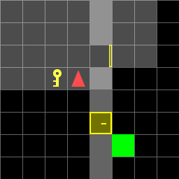
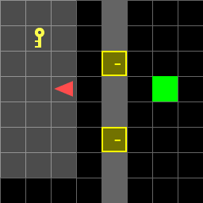

# ECE 276B Project 1: Dynamic Programming for Autonomous Navigation in a Door and Key Environment

# Introduction

This project involves implementing autonomous navigation in a **Door and Key** environment, where the task is to get the agent to the goal position as efficiently as possible. The environment may contain a door that blocks the way to the goal, and a locked door needs to be opened by a key. Applications of this problem include efficient motion planning for autonomous robots, such as cleaning robots, delivery robots, etc. The approach can also extend to solving decision-making games and building AI agents for games such as maze solvers, etc. The project has two parts: **Part A** involves using dynamic programming (DP) on a known map to find the optimal policy, while **Part B** involves running DP only once to find the optimal policy and then using this policy to navigate the agent in an unknown map. The high-level approach involves formulating a Markov Decision Process (MDP) model for the problem, including the state space, control space, motion model, and costs. The optimal policy is then found using DP, and the agent is navigated using this policy.

# Problem Statement

## Part A

Let $D$ be the dimension of the square grid world. Note that the grid world is defined such that the origin $(0,0)$ is at the top-left corner of the grid, and the $y$-axis is inverted, i.e., increasing $y$ moves the agent downwards. The bottom-right corner of the grid is $(D-1,D-1)$.

### State Space

The state space $\chi$ is defined by the set of vectors $\mathbf{x} = (x,y,v,k,d)$, where:

* $x \in \{0,1,...,D-1\}$ and $y \in \{0,1,...,D-1\}$ are the coordinates of the agent, 
* $v \in \{0,1,2,3\}$ is the direction of the agent, where 0 represents DOWN (vector $(0,1)$), 1 represents RIGHT (vector $(1,0)$), 2 represents UP (vector $(0,-1)$), and 3 represents LEFT (vector $(-1,0)$).
* $k \in \{0, 1\}$ represents whether the agent has the key (1) or not (0).
* $d \in \{0, 1\}$ represents whether the door is open (1) or closed (0).

### Initial State

Considering this definition of state space, the initial state $\mathbf{x}_0$ is given by:

$$\mathbf{x}_0 = (x_0,y_0,v_0,0,0)$$

where $(x_0,y_0)$ is the initial position of the agent, and $v_0$ is the initial direction of the agent. This can be different for each of the 7 environments. In all the 7 known environments, the door is locked by default at the start of the simulation (hence $d=0$), and the agent does not have the key (hence $k=0$).

### Control Space

The control space $\mathcal{U}$ is defined by the set of control inputs $u = (a)$, where $a \in \{0,1,2,3,4\}$ represents the action taken by the agent, where 0 represents MOVE FORWARD (MF), 1 represents TURN LEFT, 2 represents TURN RIGHT, 3 represents PICK UP KEY, and 4 represents UNLOCK DOOR.

For ease of understanding, the control inputs will be referred to as follows:

* $u = 0$ is MOVE FORWARD (MF)
* $u = 1$ is TURN LEFT (TL)
* $u = 2$ is TURN RIGHT (TR)
* $u = 3$ is PICK UP KEY (PK)
* $u = 4$ is UNLOCK DOOR (UD)

### Goal State

Let $(x_g,y_g)$ be the position of the goal. A goal state $\mathbf{x}_g$ is given by:

$$\mathbf{x}_g = (x_g,y_g,v,k,d)$$

$v$ is any arbitrary direction, since the agent is allowed to face any direction when it reaches the goal. The agent is not required to have the key or unlock the door to reach the goal, since in some maps the goal is reachable without the key or the door. Therefore, $k$ and $d$ can be arbitrary values.

Let $\mathcal{X}_g$ be the set of goal states, i.e. $\mathcal{X}_g = \{\mathbf{x}_g\}$.

### Motion Model

In this project, the motion model is deterministic and is given by:

$$\mathbf{x}_{t+1} = f(\mathbf{x}_t,u_t)$$

where $f$ is the motion model function that updates the state of the agent based on the control input. The motion model is given by:

$$f(\mathbf{x},u) = \begin{cases} (x,y,v,k,d) & \text{if } \mathbf{x} = \mathbf{x}_g, \text{regardless of input } u \\ (x,y+1,0,k,d) & \text{if } u = \text{MF} \text{ and } v = 0 \text{ and } y < D-1 \\ (x+1,y,1,k,d) & \text{if } u = \text{MF} \text{ and } v = 1 \text{ and } x < D-1 \\ (x,y-1,2,k,d) & \text{if } u = \text{MF} \text{ and } v = 2 \text{ and } y > 0 \\ (x-1,y,3,k,d) & \text{if } u = \text{MF} \text{ and } v = 3 \text{ and } x > 0 \\ (x,y,(v+1) \mod 4,k,d) & \text{if } u = \text{TL} \\ (x,y,(v-1) \mod 4,k,d) & \text{if } u = \text{TR} \\ (x,y,0,1,d) & \text{if } u = \text{PK} \text{ and } (x, y+1) = (x_k, y_k) \text{ and } k = 0 \\ (x,y,1,1,d) & \text{if } u = \text{PK} \text{ and } (x+1, y) = (x_k, y_k) \text{ and } k = 0 \\ (x,y,2,1,d) & \text{if } u = \text{PK} \text{ and } (x, y-1) = (x_k, y_k) \text{ and } k = 0 \\ (x,y,3,1,d) & \text{if } u = \text{PK} \text{ and } (x-1, y) = (x_k, y_k) \text{ and } k = 0 \\ (x,y,0,k,1) & \text{if } u = \text{UD} \text{ and } (x, y+1) = (x_d, y_d) \text{ and } k = 1 \\ (x,y,1,k,1) & \text{if } u = \text{UD} \text{ and } (x+1, y) = (x_d, y_d) \text{ and } k = 1 \\ (x,y,2,k,1) & \text{if } u = \text{UD} \text{ and } (x, y-1) = (x_d, y_d) \text{ and } k = 1 \\ (x,y,3,k,1) & \text{if } u = \text{UD} \text{ and } (x-1, y) = (x_d, y_d) \text{ and } k = 1 \\ (x,y,v,k,d) & \text{otherwise} \end{cases}$$

where $(x_k,y_k)$ is the position of the key, and $(x_d,y_d)$ is the position of the door. The agent can only pick up the key if it is facing the key (i.e. is one step away from the key in the direction of the key). Similarly, the agent can only unlock the door if it is facing the door (i.e. is one step away from the door in the direction of the door).

### Planning Horizon

The planning horizon $T$ is the number of time steps the agent is allowed to take to reach the goal. If the agent reaches the goal before $T$ steps, the simulation is terminated. The planning horizon $T = |\chi| - 1 = D^2 \times 4 \times 2 \times 2 - 1$. 

We use the number of states $|\chi|$ to calculate the planning horizon, since in the optimal trajectory, the agent will visit each state at most once.

For different grid worlds, the planning horizon is as follows:

|Grid World|Planning Horizon, $T$|
|---|---|
|5x5|399|
|6x6|575|
|8x8|1023|

Note that the actual number of time steps taken by the agent to reach the goal may be less than $T$.

### Terminal Cost Function

The terminal cost function $\frak{q}(\mathbf{x})$ is defined as:

$$\frak{q}(\mathbf{x}) = \begin{cases} 0 & \text{if } \mathbf{x} \in \mathcal{X}_g \\ \infty & \text{otherwise} \end{cases}$$

### Stage Cost Function

Let $\mathbf{W}$ be the set of $(x,y)$ positions of the walls in the environment, i.e. $\mathbf{W} = \{(x,y) \mid (x,y) \text{ is a wall}\}$.

The stage cost is 0 for any goal state and 1 for any action. If the action results in the agent hitting a wall or hitting a closed door, the stage cost is $\infty$.

Mathematically, the stage cost function $l(\mathbf{x},u)$ is defined as:

$$l(\mathbf{x},u) = \begin{cases} 0 & \text{if } \mathbf{x} \in \mathcal{X}_g \\ 1 & \text{if } \mathbf{x} \notin \mathcal{X}_g \text{ and } f(\mathbf{x},u) \notin \mathbf{W} \text{ and } f(\mathbf{x},u) \neq (x_d,y_d,v,k,0), \forall v,k \\ \infty & \text{otherwise} \end{cases}$$

### Discount Factor

The discount factor $\gamma$ is 1.

### Value Function

The value function $V^\pi_t(\mathbf{x})$ is the expected cumulative cost from state $\mathbf{x}$ at time $t$ under policy $\pi$. The value function is given by:

$$V^\pi_t(\mathbf{x}) = \mathbb{E}_{\mathbf{x}_{t+1:T}} \left[  \frak{q}(\mathbf{x}_T) + \sum_{\tau=t}^{T-1}  l(\mathbf{x}_\tau,\pi_\tau(\mathbf{x}_\tau))  \mid \mathbf{x}_t = \mathbf{x} \right]$$

Since this problem is deterministic, this can be reduced to:

$$V^\pi_t(\mathbf{x}) = \frak{q}(\mathbf{x}_T) + \sum_{\tau=t}^{T-1}  l(\mathbf{x}_\tau,\pi_\tau(\mathbf{x}_\tau))$$

Finally, we define the finite-horizon optimal control problem, as follows:

$$\min_{\pi_{t+1:T}} V^\pi_t(\mathbf{x}) \text{ subject to } \mathbf{x}_{t+1} = f(\mathbf{x}_t,\pi_t(\mathbf{x}_t)), \forall t \in \{0,1,...,T-1\}$$

$$\mathbf{x}_t \in \chi, \pi_t(\mathbf{x}_t) \in \mathcal{U}, \forall t \in \{0,1,...,T-1\}$$

The solution is given by the optimal policy $\pi^*$, given by:

$$\pi^* = \arg \min_{\pi_{t+1:T}} V^\pi_t(\mathbf{x})$$

The task is to compute the optimal policy stated above for each of the 7 environments and evaluate their performance on the corresponding environment.

## Part B

In Part B, the agent is required to navigate in an unknown environment. The size of the grid in the random maps is 8x8, hence $D=8$. Furthermore, there is a vertical wall at column 4 with two doors at (4,2) and (4,5).

Hence, $\mathbf{W} = \{(4,0),(4,1),(4,3),(4,4),(4,6),(4,7)\}$, and $\mathbf{D} = \{(4,2),(4,5)\}$, where $\mathbf{D}$ is the set of door positions.

Each door can either be open or locked (requires a key to open), and the key is randomly located in one of three positions: (1,1), (2,3), or (1,6). Therefore, we define the set of key positions $\mathbf{K} = \{(1,1),(2,3),(1,6)\}$.

The goal is randomly located in one of three positions: (1,7), (3,7), or (6,7). Therefore, we define the set of goal positions $\mathbf{G} = \{(5,1),(6,3),(5,6)\}$.

Given these contraints, we will redefine the state space, the motion model, and costs for Part B.

### State Space

The state space $\chi$ is defined by the set of vectors $\mathbf{x} = (x,y,v,k,d_1, d_2, p_k, p_g)$, where

* $x \in \{0,1,...,7\}$ and $y \in \{0,1,...,7\}$ are the coordinates of the agent,
* $v \in \{0,1,2,3\}$ is the direction of the agent, where 0 represents DOWN (vector $(0,1)$), 1 represents RIGHT (vector $(1,0)$), 2 represents UP (vector $(0,-1)$), and 3 represents LEFT (vector $(-1,0)$),
* $k \in \{0, 1\}$ represents whether the agent has the key (1) or not (0),
* $d_1 \in \{0, 1\}$ represents whether the first door (at $(4,2)$) is open (1) or closed (0),
* $d_2 \in \{0, 1\}$ represents whether the second door (at $(4,5)$) is open (1) or closed (0),
* $p_k \in \{0, 1, 2\}$ represents the position of the key, where 0 represents (1,1), 1 represents (2,3), and 2 represents (1,6),
* $p_g \in \{0, 1, 2\}$ represents the position of the goal, where 0 represents (5,1), 1 represents (6,3), and 2 represents (5,6).

### Initial State

The initial state $\mathbf{x}_0$ is given by:

$$\mathbf{x}_0 = (x_0,y_0,v_0,0,d_1,d_2,p_k,p_g)$$

where $(x_0,y_0)$ is the initial position of the agent, and $v_0$ is the initial direction of the agent. The agent does not have the key (hence $k=0$) and the each door could be either open or closed (hence $d_1,d_2 \in \{0,1\}$). The key and goal positions are provided depending on which map is being used.

### Goal State

The goal state $\mathbf{x}_g$ is given by:

$$\mathbf{x}_g = (x_g,y_g,v,k,d_1,d_2,p_k,p_g)$$

where $(x_g,y_g)$ is the position of the goal. The agent is not required to have the key or unlock the door to reach the goal, since in some maps the goal is reachable without the key or the door. Therefore, $k$ and $d_1,d_2$ can be arbitrary values.

Let $\mathcal{X}_g$ be the set of goal states, i.e. $\mathcal{X}_g = \{\mathbf{x}_g\}$.

### Action Space

The action space $\mathcal{U}$ remains the same as in Part A.

### Motion Model

The motion model is given by:

$$f(\mathbf{x},u) = \begin{cases} (x,y,v,k,d_1,d_2,p_k,p_g) & \text{if } \mathbf{x} \in \mathcal{X}_g, \text{regardless of input } u \\ (x,y+1,0,k,d_1,d_2,p_k,p_g) & \text{if } u = \text{MF} \text{ and } v = 0 \text{ and } y < 7 \\ (x+1,y,1,k,d_1,d_2,p_k,p_g) & \text{if } u = \text{MF} \text{ and } v = 1 \text{ and } x < 7 \\ (x,y-1,2,k,d_1,d_2,p_k,p_g) & \text{if } u = \text{MF} \text{ and } v = 2 \text{ and } y > 0 \\ (x-1,y,3,k,d_1,d_2,p_k,p_g) & \text{if } u = \text{MF} \text{ and } v = 3 \text{ and } x > 0 \\ (x,y,(v+1) \mod 4,k,d_1,d_2,p_k,p_g) & \text{if } u = \text{TL} \\ (x,y,(v-1) \mod 4,k,d_1,d_2,p_k,p_g) & \text{if } u = \text{TR} \\ (x,y,0,1,d_1,d_2,p_k,p_g) & \text{if } u = \text{PK} \text{ and } (x, y+1) = (x_k, y_k) \text{ and } k = 0 \\ (x,y,1,1,d_1,d_2,p_k,p_g) & \text{if } u = \text{PK} \text{ and } (x+1, y) = (x_k, y_k) \text{ and } k = 0 \\ (x,y,2,1,d_1,d_2,p_k,p_g) & \text{if } u = \text{PK} \text{ and }  (x, y-1) = (x_k, y_k) \text{ and } k = 0 \\ (x,y,3,1,d_1,d_2,p_k,p_g) & \text{if } u = \text{PK} \text{ and } (x-1, y) = (x_k, y_k) \text{ and } k = 0 \\ (x,y,0,k,1,d_2,p_k,p_g) & \text{if } u = \text{UD} \text{ and } (x, y+1) = (4,2) \text{ and } k = 1 \\ (x,y,1,k,1,d_2,p_k,p_g) & \text{if } u = \text{UD} \text{ and } (x+1, y) = (4,2) \text{ and } k = 1 \\ (x,y,2,k,1,d_2,p_k,p_g) & \text{if } u = \text{UD} \text{ and } (x, y-1) = (4,2) \text{ and } k = 1 \\ (x,y,3,k,1,d_2,p_k,p_g) & \text{if } u = \text{UD} \text{ and } (x-1, y) = (4,2) \text{ and } k = 1 \\ (x,y,0,k,d_1,1,p_k,p_g) & \text{if } u = \text{UD} \text{ and } (x, y+1) = (4,5) \text{ and } k = 1 \\ (x,y,1,k,d_1,1,p_k,p_g) & \text{if } u = \text{UD} \text{ and } (x+1, y) = (4,5) \text{ and } k = 1 \\ (x,y,2,k,d_1,1,p_k,p_g) & \text{if } u = \text{UD} \text{ and } (x, y-1) = (4,5) \text{ and } k = 1 \\ (x,y,3,k,d_1,1,p_k,p_g) & \ \text{if } u = \text{UD} \text{ and } (x-1, y) = (4,5) \text{ and } k = 1 \\ (x,y,v,k,d_1,d_2,p_k,p_g) & \text{otherwise} \end{cases}$$

where $(x_k,y_k)$ is the position of the key,  which is determined based on $p_k$ in the way described above.

### Planning Horizon

The planning horizon $T$ is the maximum number of time steps the agent is allowed to take to reach the goal. If the agent reaches the goal before $T$ steps, the simulation is terminated. 

The planning horizon $T = |\chi| - 1 = 8^2 \times 4 \times 2 \times 2 \times 2 \times 3 \times 3 - 1 = 18431$.

Despite this large planning horizon, the agent may reach the goal in fewer steps.

### Terminal Cost Function

Similar to part A, the terminal cost function $\frak{q}(\mathbf{x})$ is defined as:

$$\frak{q}(\mathbf{x}) = \begin{cases} 0 & \text{if } \mathbf{x} \in \mathcal{X}_g \\ \infty & \text{otherwise} \end{cases}$$

### Stage Cost Function

Let $\mathbf{D}_{\text{locked}} \subset \chi$ be the set of states where the door is locked and the agent's position is at the door. This position is not allowed (as the agent cannot move through a locked door). Mathematically, $\mathbf{D}_{\text{locked}} = \{ (4,2,v,k,0,d_2,p_k,p_g), (4,5,v,k,d_1,0,p_k,p_g) \}$.

The stage cost function $l(\mathbf{x},u)$ is defined as:

$$l(\mathbf{x},u) = \begin{cases} 0 & \text{if } \mathbf{x} \in \mathcal{X}_g \\ 1 & \text{if } \mathbf{x} \notin \mathcal{X}_g \text{ and } f(\mathbf{x},u) \notin \mathbf{W} \text{ and } f(\mathbf{x},u) \notin \mathbf{D}_{\text{locked}} \\ \infty & \text{otherwise} \end{cases}$$

### Discount Factor

The discount factor $\gamma$ is 1.

### Value Function

The value function $V^\pi_t(\mathbf{x})$ is the expected cumulative cost from state $\mathbf{x}$ at time $t$ under policy $\pi$. The value function is given by:

$$V^\pi_t(\mathbf{x}) = \mathbb{E}_{\mathbf{x}_{t+1:T}} \left[  \frak{q}(\mathbf{x}_T) + \sum_{\tau=t}^{T-1}  l(\mathbf{x}_\tau,\pi_\tau(\mathbf{x}_\tau))  \mid \mathbf{x}_t = \mathbf{x} \right]$$

Since this problem is deterministic, this can be reduced to:

$$V^\pi_t(\mathbf{x}) = \frak{q}(\mathbf{x}_T) + \sum_{\tau=t}^{T-1}  l(\mathbf{x}_\tau,\pi_\tau(\mathbf{x}_\tau))$$

Finally, we define the finite-horizon optimal control problem, as follows:

$$\min_{\pi_{t+1:T}} V^\pi_t(\mathbf{x}) \text{ subject to } \mathbf{x}_{t+1} = f(\mathbf{x}_t,\pi_t(\mathbf{x}_t)), \forall t \in \{0,1,...,T-1\}$$

$$\mathbf{x}_t \in \chi, \pi_t(\mathbf{x}_t) \in \mathcal{U}, \forall t \in \{0,1,...,T-1\}$$

The solution is given by the optimal policy $\pi^*$, given by:

$$\pi^* = \arg \min_{\pi_{t+1:T}} V^\pi_t(\mathbf{x})$$

The task is to compute the optimal policy stated above for the random maps and evaluate their performance on the corresponding environment.

# Technical Approach

To obtain an optimal control policy $\pi^*$ that minimizes the agent's cost to reach the goal, we will use **dynamic programming (DP)**.

Regardless of whether we are solving Part A or Part B, the DP algorithm involves the same steps. The only difference is in the state space, motion model, and costs, which are defined differently for Part A and Part B. 

Therefore, we will define the DP algorithm in a generic way, and then specify the state space, motion model, and costs for Part A and Part B.

## Dynamic Programming Algorithm

An MDP is defined by the tuple $(\chi, \mathcal{U}, p_0, p_f, T, l, \frak{q}, \gamma)$. In our problem, the transitions are deterministic, and hence this can be rewritten as $(\chi, \mathcal{U}, \mathbf{x}_0, f, T, l, \frak{q}, \gamma)$. The DP algorithm to find the optimal policy $\pi^*$ is as follows:

1. **Initialization**: Initialize the value function $V_{T}(\mathbf{x}) = \frak{q}(\mathbf{x})$ for all $\mathbf{x} \in \chi$.

2. **Value Iteration**: For $t = T-1, ..., 0$, do:
    * For each $\mathbf{x} \in \chi$ and for each $u \in \mathcal{U}$, compute:
    $Q_t(\mathbf{x},u) = l(\mathbf{x},u) + \gamma \sum_{\mathbf{x}' \in \chi} p(\mathbf{x}' \mid \mathbf{x},u) V_{t+1}(\mathbf{x}') = l(\mathbf{x},u) + \gamma V_{t+1}(f(\mathbf{x},u))$ (since the transitions are deterministic).
    * Update the value function:
    $V_t(\mathbf{x}) = \min_{u \in \mathcal{U}} Q_t(\mathbf{x},u), \forall \mathbf{x} \in \chi$.
    * Update the policy:
    $\pi_t(\mathbf{x}) = \arg \min_{u \in \mathcal{U}} Q_t(\mathbf{x},u), \forall \mathbf{x} \in \chi$.

    * **Termination Condition**: if $V_t(\mathbf{x}) = V_{t+1}(\mathbf{x}), \forall \mathbf{x} \in \chi$, then break.

3. **Return**: The optimal policy is given by $\pi^* = \pi_0$ and optimal value function is $V^* = V_0$. If termination occurs early, the optimal policy is given by $\pi^* = \pi_t$ and optimal value function is $V^* = V_t$, where $t$ is the last iteration.

## Implementation Details

### Part A

In this part, DP is run on each environment separately.

For each environment:
* The positions of the walls $\mathbf{W}$, the key $(x_k,y_k)$, the door $(x_d,y_d)$, and the goal $(x_g,y_g)$ are provided.
* The set of all possible states $\chi$ is defined.
* The initial state $\mathbf{x}_0 = (x_0,y_0,v_0,0,0)$ is deduced from the initial position and direction of the agent.
* The set of goal states $\mathcal{X}_g = \{(x_g,y_g,v,k,d) \mid v \in \{0,1,2,3\}, k \in \{0,1\}, d \in \{0,1\}\}$ is defined.
* The planning horizon $T$ is calculated using the formula $T = |\chi| - 1$ as explained above.
* The terminal cost function $\frak{q}(\mathbf{x})$ and stage cost function $l(\mathbf{x},u)$ are defined as explained above.
* DP is run using the generic DP algorithm explained above on the defined MDP.
* The optimal policy $\pi^*$ is obtained.

To compute the resulting sequence actions until the goal is reached, the optimal policy $\pi^*$ is used to navigate the agent in the environment. The agent starts at the initial state $\mathbf{x}_0$ and takes the action $\pi^*(\mathbf{x}_0)$ to reach the next state $\mathbf{x}_1$. This process is repeated until the goal is reached.

#### Finding the sequence of actions

1. Initialize the current state $\mathbf{x} = \mathbf{x}_0$.
2. Initialize the sequence of actions $\mathbf{u} = []$.
3. While $\mathbf{x} \notin \mathcal{X}_g$:
    * Compute the action $u = \pi^*(\mathbf{x})$.
    * Append $u$ to $\mathbf{u}$.
    * Update the current state $\mathbf{x} = f(\mathbf{x},u)$.
    * Repeat until $\mathbf{x} \in \mathcal{X}_g$.
4. Return the sequence of actions $\mathbf{u}$.

The above steps allow us to isolate the sequence of actions that the agent needs to take to reach the goal, and remove the actions that take place after the goal is reached (since the simulation is terminated once the goal is reached).

### Part B

In this part, DP is run only once to find the optimal policy for the random maps. 

This is done by identifying the possible states, $\chi$ based on the description provided above.

Every state in $\chi$ is of the form $(x,y,v,k,d_1,d_2,p_k,p_g)$, where $x,y,v,k,d_1,d_2,p_k,p_g$ are as defined above.

Since the door positions $\mathbf{D}$ are known and it is known that column 4 is a wall (with the exception of the doors), the dynamic programming can be run considering all possible goal positions and key positions as part of the state space.

Using the defined state space, motion model, and costs for part B, DP is run using the generic DP algorithm explained above.

Running DP gives a resulting optimal policy $\pi^*$, which is used to navigate the agent in any unknown environment satisfying the constraints provided in the problem statement with regards to the walls, doors, key, and goal positions.

Now that there is an optimal policy from DP, the agent can navigate in any unknown environment by following the optimal policy.

#### Finding the sequence of actions

For each environment, the initial state $\mathbf{x}_0$ is found based on the initial position and direction of the agent, and the key and goal positions of the environment, and whether the doors are open or closed initially.

$$\mathbf{x}_0 = (x_0,y_0,v_0,0,d_1,d_2,p_k,p_g)$$

At the beginning, the agent does not have the key, and the doors are either open or closed based on the environment. $p_k$ and $p_g$ are the positions of the key and goal, respectively, and are determined based on the environment.

The sequence of actions is found by following the optimal policy $\pi^*$.

1. Initialize the current state $\mathbf{x} = \mathbf{x}_0$.
2. Initialize the sequence of actions $\mathbf{u} = []$.
3. While $\mathbf{x} \notin \mathcal{X}_g$:
    * Compute the action $u = \pi^*(\mathbf{x})$.
    * Append $u$ to $\mathbf{u}$.
    * Update the current state $\mathbf{x} = f(\mathbf{x},u)$.
    * Repeat until $\mathbf{x} \in \mathcal{X}_g$.
    * If the agent reaches the goal, the simulation is terminated.
* Return the sequence of actions $\mathbf{u}$.

Again, it is noted that the same policy $\pi^*$ is used to navigate the agent in all of the 36 unknown environments provided in the problem statement. Using the larger state space allows different key and goal positions and door configurations to be considered in the same policy. This allows for a more universal policy.

### Code Details

In the provided code, the algorithms in parts A and B can be run by running:

```bash
python doorkey.py
```

This will first run part A, where DP is run on each of the 7 known environments to find the optimal policy. The agent's performance is evaluated in each of the 7 environments.

Next, part B is run, where DP is done once to find the optimal policy for the random maps. The agent's performance is evaluated in each of the 36 random maps.

The resulting `.gif` files are saved in the `gif` folder.


# Results

After using my implementation of the DP algorithm to find the optimal policy for each of the 7 known environments and the 36 random maps, the agent's performance was evaluated in each of the environments.

## Part A: Known Map

### 5x5 Normal

Sequence of actions for the 5x5 Normal environment:

['TL', 'TL', 'PK', 'TR', 'UD', 'MF', 'MF', 'TR', 'MF']

Cost: 9

|||||
|---|---|---|---|
|||||
|||||
|||||

### 6x6 Direct

Sequence of actions for the 6x6 Direct environment:

['MF', 'MF', 'TR', 'MF', 'MF']

Cost: 5

||||
|---|---|---|
||||
||||

### 6x6 Normal

Sequence of actions for the 6x6 Normal environment:

['TL', 'MF', 'PK', 'TL', 'MF', 'TL', 'MF', 'TR', 'UD', 'MF', 'MF', 'TR', 'MF']

Cost: 13

|||||
|---|---|---|---|
|||||
|||||
|||||
|||||

### 6x6 Shortcut

Sequence of actions for the 6x6 Shortcut environment:

['PK', 'TL', 'TL', 'UD', 'MF', 'MF']

Cost: 6

||||||
|---|---|---|---|---|
||||||
||||||

### 8x8 Direct

Sequence of actions for the 8x8 Direct environment:

['MF', 'TL', 'MF', 'MF', 'MF', 'TL', 'MF']

Cost: 7

|||||
|---|---|---|---|
|||||
|||||

### 8x8 Normal

Sequence of actions for the 8x8 Normal environment:

['TR', 'MF', 'TL', 'MF', 'TR', 'MF', 'MF', 'MF', 'PK', 'TL', 'TL', 'MF', 'MF', 'MF', 'TR', 'UD', 'MF', 'MF', 'MF', 'TR', 'MF', 'MF', 'MF']

Cost: 23

|||||
|---|---|---|---|
|||||
|||||
|||||
|||||
|||||
|||||

### 8x8 Shortcut

Sequence of actions for the 8x8 Shortcut environment:

['TR', 'MF', 'TR', 'PK', 'TL', 'UD', 'MF', 'MF']

Cost: 8

||||||
|---|---|---|---|---|
||||||
||||||

### 8x8 Example

Sequence of actions for the 8x8 Example environment:

['TR', 'MF', 'PK', 'TL', 'UD', 'MF', 'MF', 'MF', 'MF', 'TR', 'MF']

Cost: 11

|||||
|---|---|---|---|
|||||
|||||
|||||

## Part B: Random Maps

The optimal policy obtained from DP is used to navigate the agent in the 36 random maps. The agent's performance is evaluated in each of the random maps.

**Note:** Since there are several random maps, only a few random maps are shown here as a sample. All the resulting .gif files are saved in the `gif` folder in the **Code** submission on Gradescope.

### Random Map 1

Action Sequence: ['TR', 'MF', 'MF', 'TR', 'MF']

Cost: 5

|||||
|---|---|---|---|
|||||
|||||

### Random Map 2

['MF', 'MF', 'MF', 'MF', 'TL', 'MF', 'PK', 'TL', 'MF', 'TL', 'MF', 'UD', 'MF', 'MF', 'MF', 'TR', 'MF']

Cost: 17

|||||
|---|---|---|---|
|||||
|||||
|||||
|||||
|||||

### Random Map 3

['TR', 'MF', 'MF', 'TR', 'MF']

Cost: 5

|||||
|---|---|---|---|
|||||
|||||

### Random Map 4

['TR', 'MF', 'MF', 'TR', 'MF']

Cost: 5

|||||
|---|---|---|---|
|||||
|||||

### Random Map 5

['MF', 'MF', 'TL', 'PK', 'TR', 'MF', 'TR', 'UD', 'MF', 'MF', 'MF', 'TR', 'MF']

Cost: 13

|||||
|---|---|---|---|
|||||
|||||
|||||
|||||

### Random Map 6

['MF', 'MF', 'MF', 'TR', 'MF', 'MF', 'TR', 'MF', 'MF', 'MF', 'MF']

Cost: 11

|||||
|---|---|---|---|
|||||
|||||
|||||

### Random Map 7

['MF', 'MF', 'MF', 'TR', 'MF', 'MF', 'TR', 'MF', 'MF', 'MF', 'MF']

Cost: 11

|||||
|---|---|---|---|
|||||
|||||
|||||

### Random Map 30

['TR', 'MF', 'MF', 'MF', 'TL', 'MF', 'MF']

Cost: 7

|||||
|---|---|---|---|
|||||
|||||

### Random Map 36

['MF', 'MF', 'MF', 'TR', 'MF', 'MF', 'TL', 'MF']

Cost: 8

|||||
|---|---|---|---|
|||||
|||||
|||||


## Agent with Different Starting Positions and Directions

To test part B even further, it is good to investigate the effect of different starting positions and directions for the agent.

### Starting Position: (2,3), Direction: Left

After changing the starting position and direction, the agent still successfully navigates to the goal using the optimal policy obtained from DP.

['TL', 'MF', 'MF', 'TL', 'MF', 'MF', 'MF', 'TR', 'MF']

Cost: 9

|||||
|---|---|---|---|
|||||
|||||
|||||

Another example:

Optimal Policy: ['MF', 'TR', 'MF', 'PK', 'TR', 'MF', 'MF', 'UD', 'MF', 'MF', 'MF', 'TR', 'MF']

Cost: 13

|||||
|---|---|---|---|
|||||
|||||
|||||
|||||

Another example:

['TR', 'MF', 'TR', 'MF', 'MF', 'MF', 'TR', 'MF', 'MF', 'MF', 'MF']

Cost: 11

|||||
|---|---|---|---|
|||||
|||||
|||||


### Starting Position: (0,4), Direction: Down

After changing the starting position and direction again, the agent still successfully navigates to the goal using the optimal policy obtained from DP.

One example:

Optimal Policy: ['MF', 'TL', 'MF', 'MF', 'MF', 'MF', 'MF', 'TR', 'MF']

Cost: 9

|||||
|---|---|---|---|
|||||
|||||
|||||

Another example:

Optimal Policy: ['TL', 'MF', 'TL', 'MF', 'MF', 'PK', 'TR', 'MF', 'MF', 'UD', 'MF', 'MF', 'MF', 'TR', 'MF']

Cost: 15

|||||
|---|---|---|---|
|||||
|||||
|||||
|||||

Another example:

Optimal Policy: ['MF', 'TL', 'MF', 'MF', 'MF', 'MF', 'MF', 'TR', 'MF']

Cost: 9

|||||
|---|---|---|---|
|||||
|||||
|||||

### Starting Position: (6,7), Direction: Right

One example:

['TL', 'MF', 'TL', 'MF']

Cost: 4

|||||
|---|---|---|---|
|||||
|||||

Another example:

['TL', 'MF', 'MF', 'MF', 'MF']

Cost: 5

|||||
|---|---|---|---|
|||||
|||||

Another example:

['TL', 'MF', 'TL', 'MF']

Cost: 4

|||||
|---|---|---|---|
|||||
|||||

## Discussion of Performance

This section describes the performance of the DP algorithm in finding the optimal policy for the agent to navigate in the grid world with walls, doors, keys, and goals.

### Part A: Known Map

* **Correctness**: The DP algorithm was able to find the optimal policy for the agent to navigate in each of the 7 known environments. The agent was able to successfully navigate to the goal in each of the environments using the optimal policy obtained from DP. By visual inspection, it was clear that the path was optimal in each case.
* **Efficiency**: The DP algorithm implementation was efficient as the representation of the state space was as compact as possible, and the motion model computations were vectorized.

### Part B: Random Maps

* **Correctness**: Even though we had one policy that worked for all 36 random maps, the agent was able to successfully navigate to the goal in each of the random maps using the optimal policy obtained from DP. By visual inspection, it was clear that the path was optimal in each case. This was an interesting result, as one policy was able to work for all the random maps. This has potential use cases in autonomous navigation, as it avoids the need to recompute the policy for each new environment.
* **Efficiency**: Again, I made the state space representation as compact as possible following the definitions in the Problem Statement section. The motion model computations were vectorized, which made the DP algorithm efficient.

It takes 7-8 seconds to run all the known and random maps, which is reasonable given the complexity of the problem.

# Conclusion

In this project, I implemented a dynamic programming algorithm to find the optimal policy for an agent to navigate in a grid world with walls, doors, keys, and goals. The agent was able to successfully navigate in both known and unknown environments using the optimal policy obtained from dynamic programming.
