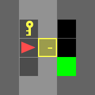
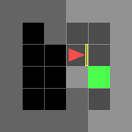
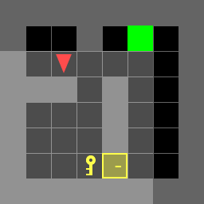
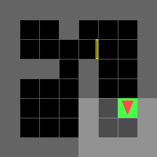
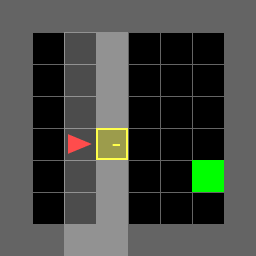
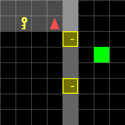
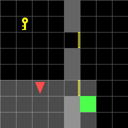

# ECE 276B Project 1 • Dynamic Programming for Autonomous Navigation

> **Code is private.** Contact me for access.

## One‑sentence overview

Dynamic programming drives an agent through door‑and‑key mazes to the goal in the fewest moves, producing policies that generalize across 40 test worlds.

## Applications

* **Planning under uncertainty:** Complete MDP formulation and optimal control.
* **Efficient policy reuse:** One policy handles thirty‑six unseen maps without retraining.
* **Clean robotics stack:** Numpy‑vectorized DP, fast visualization, and automated GIF reporting.

## Quick technical summary

| Item        | Details                                                     |
| ----------- | ----------------------------------------------------------- |
| Environment | Grid world with walls, keyed doors, moving agent            |
| State       | $(x, y, v, k, d\_1, d\_2, p\_k, p\_g)$ up to 18 431 states  |
| Actions     | Move Forward, Turn Left, Turn Right, Pick Key, Unlock Door  |
| Cost        | Unit per move, infinity for collisions                      |
| Solver      | Finite horizon value iteration with early convergence check |
| Performance | Full benchmark suite runs in < 8 s on laptop                |

---

# Results

After using my implementation of the DP algorithm to find the optimal policy for each of the 7 known environments and the 36 random maps, the agent's performance was evaluated in each of the environments.

## Part A: Known Map

### 5x5 Normal

Sequence of actions for the 5x5 Normal environment:

\['TL', 'TL', 'PK', 'TR', 'UD', 'MF', 'MF', 'TR', 'MF']

Cost: 9

|                                         |                                         |                                         |                                         |
| --------------------------------------- | --------------------------------------- | --------------------------------------- | --------------------------------------- |
|  |  |  |  |
|  |  |  |  |
|  |  |                                         |                                         |

### 6x6 Direct

Sequence of actions for the 6x6 Direct environment:

\['MF', 'MF', 'TR', 'MF', 'MF']

Cost: 5

|                                         |                                         |                                         |
| --------------------------------------- | --------------------------------------- | --------------------------------------- |
|  |  |  |
|  |  |  |

### 6x6 Normal

Sequence of actions for the 6x6 Normal environment:

\['TL', 'MF', 'PK', 'TL', 'MF', 'TL', 'MF', 'TR', 'UD', 'MF', 'MF', 'TR', 'MF']

Cost: 13

|                                          |                                          |                                          |                                          |
| ---------------------------------------- | ---------------------------------------- | ---------------------------------------- | ---------------------------------------- |
|   |   |   |   |
|   |   |   |   |
|   |   |  |  |
|  |  |                                          |                                          |

### 6x6 Shortcut

Sequence of actions for the 6x6 Shortcut environment:

\['PK', 'TL', 'TL', 'UD', 'MF', 'MF']

Cost: 6

|                                         |                                         |                                         |                                         |                                         |
| --------------------------------------- | --------------------------------------- | --------------------------------------- | --------------------------------------- | --------------------------------------- |
|  |  |  |  |  |
|  |  |                                         |                                         |                                         |

### 8x8 Direct

Sequence of actions for the 8x8 Direct environment:

\['MF', 'TL', 'MF', 'MF', 'MF', 'TL', 'MF']

Cost: 7

|                                         |                                         |                                         |                                         |
| --------------------------------------- | --------------------------------------- | --------------------------------------- | --------------------------------------- |
|  |  |  |  |
|  |  |  |  |

### 8x8 Normal

Sequence of actions for the 8x8 Normal environment:

\['TR', 'MF', 'TL', 'MF', 'TR', 'MF', 'MF', 'MF', 'PK', 'TL', 'TL', 'MF', 'MF', 'MF', 'TR', 'UD', 'MF', 'MF', 'MF', 'TR', 'MF', 'MF', 'MF']

Cost: 23

|                                          |                                          |                                          |                                          |
| ---------------------------------------- | ---------------------------------------- | ---------------------------------------- | ---------------------------------------- |
|   |   |   |   |
|   |   |   |   |
|   |   |  |  |
|  |  |  |  |
|  |  |  |  |
|  |  |  |  |

### 8x8 Shortcut

Sequence of actions for the 8x8 Shortcut environment:

\['TR', 'MF', 'TR', 'PK', 'TL', 'UD', 'MF', 'MF']

Cost: 8

|                                         |                                         |                                         |                                         |                                         |
| --------------------------------------- | --------------------------------------- | --------------------------------------- | --------------------------------------- | --------------------------------------- |
|  |  |  |  |  |
|  |  |  |  |                                         |

### 8x8 Example

Sequence of actions for the 8x8 Example environment:

\['TR', 'MF', 'PK', 'TL', 'UD', 'MF', 'MF', 'MF', 'MF', 'TR', 'MF']

Cost: 11

|                                         |                                         |                                          |                                          |
| --------------------------------------- | --------------------------------------- | ---------------------------------------- | ---------------------------------------- |
|  |  |   |   |
|  |  |   |   |
|  |  |  |  |

## Part B: Random Maps

The optimal policy obtained from DP is used to navigate the agent in the 36 random maps. The agent's performance is evaluated in each of the random maps.

**Note:** Since there are several random maps, only a few random maps are shown here as a sample. All the resulting .gif files are saved in the `gif` folder in the **Code** submission on Gradescope.

### Random Map 1

Action Sequence: \['TR', 'MF', 'MF', 'TR', 'MF']

Cost: 5

|                                         |                                         |                                         |                                         |
| --------------------------------------- | --------------------------------------- | --------------------------------------- | --------------------------------------- |
|  |  |  |  |
|  |  |                                         |                                         |

### Random Map 2

\['MF', 'MF', 'MF', 'MF', 'TL', 'MF', 'PK', 'TL', 'MF', 'TL', 'MF', 'UD', 'MF', 'MF', 'MF', 'TR', 'MF']

Cost: 17

|                                          |                                          |                                          |                                          |
| ---------------------------------------- | ---------------------------------------- | ---------------------------------------- | ---------------------------------------- |
|   |   |   |   |
|   |   |   |   |
|   |   |  |  |
|  |  |  |  |
|  |  |                                          |                                          |

### Random Map 3

\['TR', 'MF', 'MF', 'TR', 'MF']

Cost: 5

|                                         |                                         |                                         |                                         |
| --------------------------------------- | --------------------------------------- | --------------------------------------- | --------------------------------------- |
|  |  |  |  |
|  |  |                                         |                                         |

### Random Map 4

\['TR', 'MF', 'MF', 'TR', 'MF']

Cost: 5

|                                         |                                         |                                         |                                         |
| --------------------------------------- | --------------------------------------- | --------------------------------------- | --------------------------------------- |
|  |  |  |  |
|  |  |                                         |                                         |

### Random Map 5

\['MF', 'MF', 'TL', 'PK', 'TR', 'MF', 'TR', 'UD', 'MF', 'MF', 'MF', 'TR', 'MF']

Cost: 13

|                                          |                                          |                                          |                                          |
| ---------------------------------------- | ---------------------------------------- | ---------------------------------------- | ---------------------------------------- |
|   |   |   |   |
|   |   |   |   |
|   |   |  |  |
|  |  |                                          |                                          |

### Random Map 6

\['MF', 'MF', 'MF', 'TR', 'MF', 'MF', 'TR', 'MF', 'MF', 'MF', 'MF']

Cost: 11

|                                         |                                         |                                          |                                          |
| --------------------------------------- | --------------------------------------- | ---------------------------------------- | ---------------------------------------- |
|  |  |   |   |
|  |  |   |   |
|  |  |  |  |

### Random Map 7

\['MF', 'MF', 'MF', 'TR', 'MF', 'MF', 'TR', 'MF', 'MF', 'MF', 'MF']

Cost: 11

|                                         |                                         |                                          |                                          |
| --------------------------------------- | --------------------------------------- | ---------------------------------------- | ---------------------------------------- |
|  |  |   |   |
|  |  |   |   |
|  |  |  |  |

### Random Map 30

\['TR', 'MF', 'MF', 'MF', 'TL', 'MF', 'MF']

Cost: 7

|                                          |                                          |                                          |                                          |
| ---------------------------------------- | ---------------------------------------- | ---------------------------------------- | ---------------------------------------- |
|  |  |  |  |
|  |  |  |  |

### Random Map 36

\['MF', 'MF', 'MF', 'TR', 'MF', 'MF', 'TL', 'MF']

Cost: 8

|                                          |                                          |                                          |                                          |
| ---------------------------------------- | ---------------------------------------- | ---------------------------------------- | ---------------------------------------- |
|  |  |  |  |
|  |  |  |  |
|  |                                          |                                          |                                          |

## Agent with Different Starting Positions and Directions

To test part B even further, it is good to investigate the effect of different starting positions and directions for the agent.

### Starting Position: (2,3), Direction: Left

After changing the starting position and direction, the agent still successfully navigates to the goal using the optimal policy obtained from DP.

\['TL', 'MF', 'MF', 'TL', 'MF', 'MF', 'MF', 'TR', 'MF']

Cost: 9

|                                           |                                           |                                           |                                           |
| ----------------------------------------- | ----------------------------------------- | ----------------------------------------- | ----------------------------------------- |
|  |  |  |  |
|  |  |  |  |
|  |  |                                           |                                           |

Another example:

Optimal Policy: \['MF', 'TR', 'MF', 'PK', 'TR', 'MF', 'MF', 'UD', 'MF', 'MF', 'MF', 'TR', 'MF']

Cost: 13

|                                            |                                            |                                            |                                            |
| ------------------------------------------ | ------------------------------------------ | ------------------------------------------ | ------------------------------------------ |
|   |   |   |   |
|   |   |   |   |
|   |   |  |  |
|  |  |                                            |                                            |

Another example:

\['TR', 'MF', 'TR', 'MF', 'MF', 'MF', 'TR', 'MF', 'MF', 'MF', 'MF']

Cost: 11

|                                           |                                           |                                            |                                            |
| ----------------------------------------- | ----------------------------------------- | ------------------------------------------ | ------------------------------------------ |
|  |  |   |   |
|  |  |   |   |
|  |  |  |  |

### Starting Position: (0,4), Direction: Down

After changing the starting position and direction again, the agent still successfully navigates to the goal using the optimal policy obtained from DP.

One example:

Optimal Policy: \['MF', 'TL', 'MF', 'MF', 'MF', 'MF', 'MF', 'TR', 'MF']

Cost: 9

|                                           |                                           |                                           |                                           |
| ----------------------------------------- | ----------------------------------------- | ----------------------------------------- | ----------------------------------------- |
|  |  |  |  |
|  |  |  |  |
|  |  |                                           |                                           |

Another example:

Optimal Policy: \['TL', 'MF', 'TL', 'MF', 'MF', 'PK', 'TR', 'MF', 'MF', 'UD', 'MF', 'MF', 'MF', 'TR', 'MF']

Cost: 15

|                                            |                                            |                                            |                                            |
| ------------------------------------------ | ------------------------------------------ | ------------------------------------------ | ------------------------------------------ |
|   |   |   |   |
|   |   |   |   |
|   |   |  |  |
|  |  |  |  |

Another example:

Optimal Policy: \['MF', 'TL', 'MF', 'MF', 'MF', 'MF', 'MF', 'TR', 'MF']

Cost: 9

|                                           |                                           |                                           |                                           |
| ----------------------------------------- | ----------------------------------------- | ----------------------------------------- | ----------------------------------------- |
|  |  |  |  |
|  |  |  |  |
|  |  |                                           |                                           |

### Starting Position: (6,7), Direction: Right

One example:

\['TL', 'MF', 'TL', 'MF']

Cost: 4

|                                           |                                           |                                           |                                           |
| ----------------------------------------- | ----------------------------------------- | ----------------------------------------- | ----------------------------------------- |
|  |  |  |  |
|  |                                           |                                           |                                           |

Another example:

\['TL', 'MF', 'MF', 'MF', 'MF']

Cost: 5

|                                           |                                           |                                           |                                           |
| ----------------------------------------- | ----------------------------------------- | ----------------------------------------- | ----------------------------------------- |
|  |  |  |  |
|  |  |                                           |                                           |

Another example:

\['TL', 'MF', 'TL', 'MF']

Cost: 4

|                                           |                                           |                                           |                                           |
| ----------------------------------------- | ----------------------------------------- | ----------------------------------------- | ----------------------------------------- |
|  |  |  |  |
|  |                                           |                                           |                                           |

## Discussion of Performance

Part A: The policy is optimal in all seven known maps.  Vectorized DP finishes quickly.

Part B: A single policy solves thirty‑six unknown maps and variations in start state.  This shows strong generalization and low runtime cost.